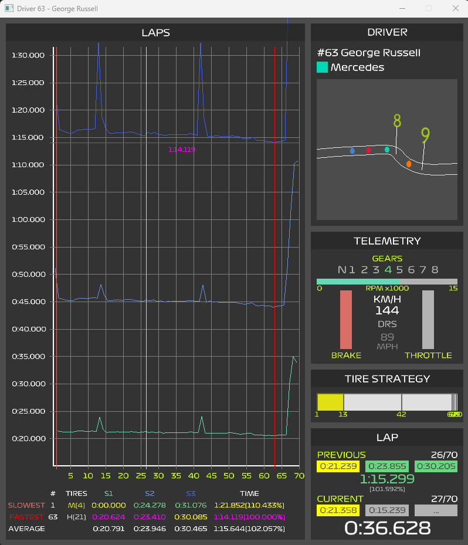

The Driver Window is packed with extra information on the specific driver.

## Driver Widget

This section is complete with basic information on the driver and a locked camera view onto their car.

The driver's race number, and full name are displayed at the top.

Their Team Color and Full Team name are shown just under it.

## Telemetry Widget

The Telemetry widget gives details on what is going on with the car at the given moment. The following information is displayed:

- Current Gear the car is in
- Engine RPM
- Speed in both kilometers per hour (km/h) and miles per hour (mph)
- Brake position (unfortunately this is a 0 or 100% value and no inbetween)
- Throttle position

## Tire Strategy Widget

The tire strategy infographic show a horizontal bar broken up into stints. Each stint shows the Lap Number it started and ended. The stint color is indicative of the tire compound used by the driver during that stint.

> Note: just because a driver goes through the pit lane doesn't mean they change tires, for the true age of the tires the leaderboard tire age mode should be used.

## Lap Widget

This shows 2 sections. One for the previous and one for the current laps. Within each section one can see the sector times and the lap time.

### Current Lap

The bottom section displays the details of the current lap. This is the more dynamic of the two sections as it counts out the times as they happen. Once the lap is complete and the driver crosses the finish line the section is reset and starts counting up for the next lap. The lap that was just completed is then displayed in the previous lap section.

### Previous Lap 

This shows the details of the lap that just completed. The sector and lap time colors are represantative of the drivers pace thus far in the race:
- $\color{#ffff00">YELLOW}$ indicates slower than the fastest time done so far by the driver
- $\color{#66d97f">GREEN}$ indicates current personal best time done by the driver
- $\color{#ff00ff">PURPLE}$ indicates a time faster than any other driver

The percentage shown below the lap time in this section is an indicator of the overall pace of the driver as it compares to the fastest lap done during the race by any driver. 100% would indicate that this lap was the fastest lap. Values >100% indicate how much slower this lap was. This is very much inline with how the Qualification times are capped at 107%.

## Laps Widget

The big laps chart is packed with full race details on the specific drivers lap and sector times.

### The Chart

The main chart shows:
- Y-axis is time
  - the chart is squished below 20s since nothing usually happens there
  - the top of the chart is typically capped at the slowest time for a non pit lap done under green flag by any driver. Values bigger than that are typically trimmed.
- X-axis is lap number

The chart contains 3 graph lines:
- $\color{#67d9b9}{LIGHT BLUE}$: Sector 1 time from the start of the lap
- $\color{#6793d9}{BLUE}$: Sector 2 Time from the start of the lap
- $\color{#3f61e8}{DARK BLUE}$: Sector 3/Lap Time from the start of the lap

The distance between the x-axis and the $\color{#67d9b9}{LIGHT BLUE}$ line is the Sector 1 delta time.

The distance between the $\color{#67d9b9}{LIGHT BLUE}$ line and the $\color{#6793d9}{BLUE}$ line is the Sector 2 delta time.

The distance between the $\color{#6793d9}{BLUE}$ line and $\color{#3f61e8}{DARK BLUE}$ line is the Sector 3 delta time.

On top of the 3 graph lines there 4 additional lines shown:
- $\color{#ff00ff}{PURPLE}$ (horizontal) displays the lap time for the fastest lap during the race by any driver. The time itself is also displayed just below the line
- $\color{#d96e66}{LIGHT RED}$ (vertical) displays the lap during which the driver did their slowest non pit lap done under green flag
- $\color{#ff0000}{RED}$ (vertical) displays the lap during which the driver did their fastest lap
- $\color{#ccff00}{HIGHLIGHTER YELLOW}$ the current lap the driver is on. (This moves as the timeline progresses)

### Stats

The section below the chart displays more details on the laps done by the driver.

The $\color{#d96e66}{SLOWEST}$ and $\color{#ff0000}{FASTEST}$ lap details are shown, including:
- Lap Number
- Tire Compound (Tire Age)
- $\color{#67d9b9}{Sector 1}$ delta time
- $\color{#6793d9}{Sector 2}$ delta time
- $\color{#3f61e8}{Sector 3}$ delta time
- Lap Time (percentage compared to the fastest lap during the race by any driver)

Below those are shown the averages for the 4 times for the entire race by the driver. These only include non pit laps done under a green flag. The idea here is to view the drivers overall pace during the race as an average.