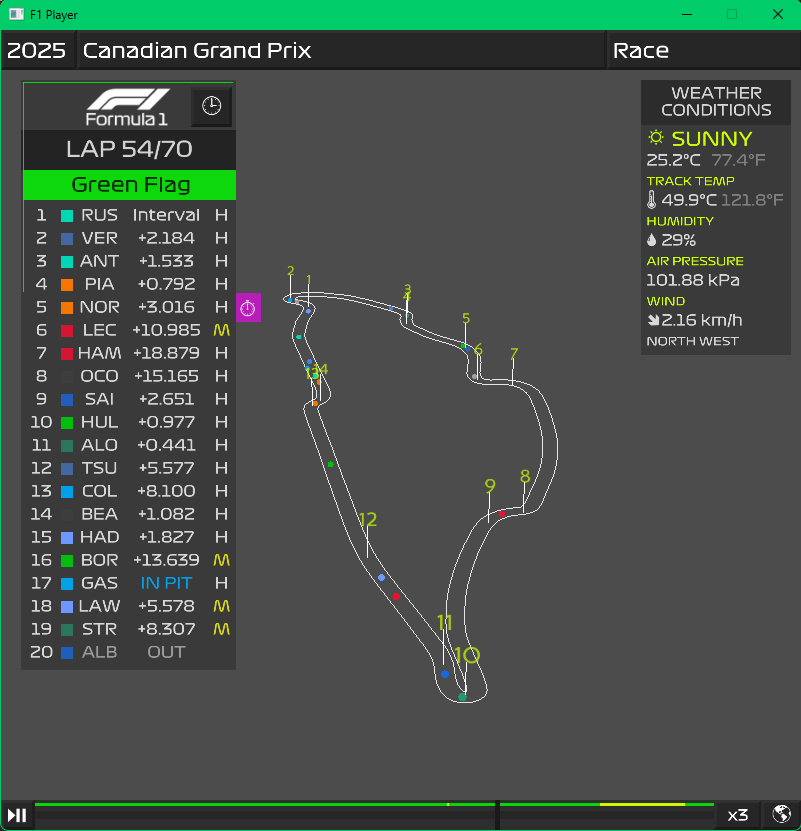
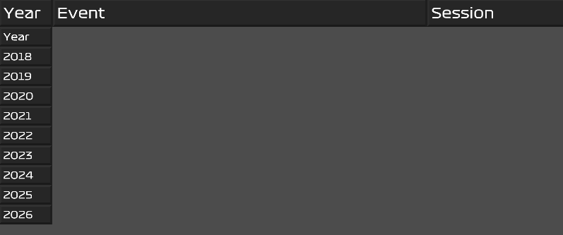
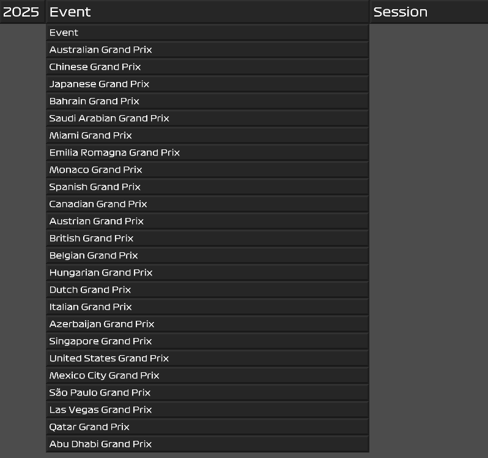
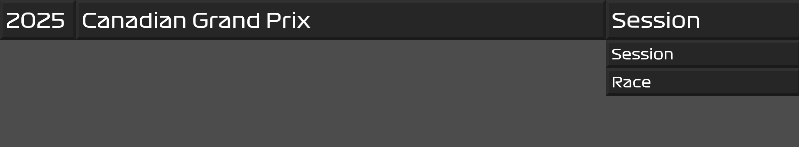
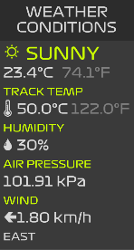
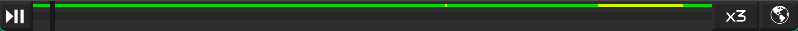
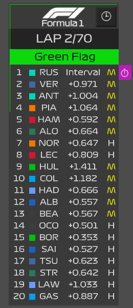

## Session Selection

The user interface begins with the selection for the session. This is done by choosing from the cascading dropdowns.

### Selecting the Year

> Note: Currently only years 2018 and older are supported. This is a limitation from the FastF1 API.

### Selecting the Event

This is a list of short names for the Grand Prix of the selected year.

### Selection the Session

> Note: Currently only `Sprint` and `Race` sessions are supported

After selecting the session a Loading Screen will be shown. Once loading is complete the main user interface will be displayed:

## Weather

As the race progresses at any given time the weather will be updated in this section. The information shown top to bottom is:

- Current weather conditions with an icon and a word describing it.
- Air Temperature in Celsius and Fahrenheit
- Track Temperature in Celsius and Fahrenheit
- Air Humidity Percentage
- Air Pressure in kilo-Pascals (kPa)
- Wind Direction (identified by an arrow and a direction word) and Speed in kilometers per hour (km/h)

## Playback & Camera

The bottom of the screen contains 4 controls the user could use to interact with the timeline and visualizations.

1. Play/Pause button on the far left to trigger the automatic playback of the timeline
2. Timeline slider, allows the user to move the timeline to any spot they would like. The colored line in the top part of the slider represent the track status at that given time. It allows the user to view any green/yellow/vsc/red flags at a glance.
3. Playback Speed button to change the automatic playback rate. Default is `x3`, and `x5` and `x10` are also possible. (The data is not good enough to do a smooth playback at `x1`, hence why it's missing.)
4. Camera view button on the far right which switches between the helicopter orbiting view and a classic top down view of the map.

## Camera Controls & Map

The map of the racetrack is rendered in full 3D, including its elevation, and turn number billboards. The turn number billboards are placed on equal height pillars anchored to the lowest point of the track. This aids in gauging the elevation change which  is visible in the orbiting camera view. Tracks like Spa or Monaco are quite interesting to see. The cars are currently represented by spheres colored in the teams primary color.

You could use the mouse buttons and movement on the screen to move the camera. It works slightly differently between the two views. See below.

### Orbiting Camera Controls

- Scrolling with the mouse wheel will zoom the camera in onto it's focus point.
- Holding down the Left Mouse button and moving the mouse up and down will change the elevation of the camera.

### Classic Top Down Camera Controls

- Scrolling with the mouse wheel will zoom the camera in onto it's focus point.
- Holding down the Left Mouse button and moving the mouse will move the entire map around allowing you to place it in a more ideal viewing spot.

## Leaderboard

The Leaderboard functions very much like the infographic in the televised F1 Races.

At the top one sees the Current Lap number and total number of Laps.

Below that we see the current track status, which changes in color and text. The same color border around the top left corner of the leaderboard also changes in the same color.

Below that we see the actual standings complete with:
- Finished Status (shows as a checkered flag on the left of the leaderboard next to the specific driver)
- Current Driver Position
- Team Color
- Driver Name Abbreviation
- Interval Times / Time to Leader / Tire Age (switchable based on mode selected, see below)
- Current Tire Compound
- Has Fastest Lap (the purple indication on the right of the leaderboard next to the specific driver)

### Leaderboard Mode

At the top right of the leaderboard there is a button (next to the F1 logo) that allows the user to switch between the 3 modes:
- Interval Time: shows the time between the driver and the car in front of them
- Time to Leader: shows the time between the driver and the leader of the race
- Tire Age: shows the number of laps done on the current set of tires

In the `Interval Time` and `Time to Leader` modes the time will be replaced with the text `IN PIT` when the driver pits. 

The driver name abbreviation would be grayed out, and the time switched to `OUT` when a driver retires before the end of the race.

### Driver Window

In order to view more detailed information for each driver the user can click on the specific driver's name abbreviation in the Leaderboard. More on that can be found in the [Driver Window](/MrSir/f1-player/wiki/features/Driver-Window) wiki page.